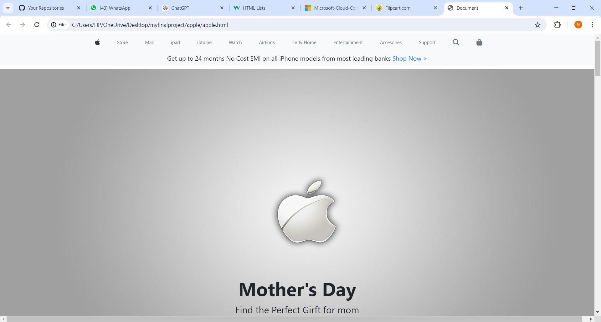
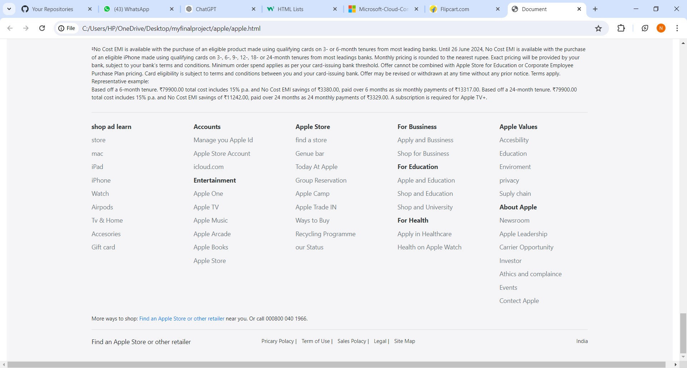

<h1>Apple Website Landing Page UI</h1>

This project is a responsive UI for the landing page of the Apple website. It has been designed using modern web technologies including HTML5, CSS3, jQuery, and Bootstrap.

## Here are some Screenshot of project

<h2 id="features">Features</h2>
<ul>
    <li>Fully responsive design</li>
    <li>Smooth scrolling and animations using jQuery</li>
    <li>Modern and clean UI inspired by Apple's design</li>
    <li>Cross-browser compatibility</li>
    <li>Utilizes Bootstrap for responsive grid layout</li>
</ul>

<h2 id="technologies-used">Technologies Used</h2>
<ul>
    <li>HTML5</li>
    <li>CSS3</li>
    <li>jQuery</li>
    <li>Bootstrap</li>
</ul>

<h2 id="installation">Installation</h2>
<ol>
    <li>Clone the repository:</li>
    <pre><code>git clone https://github.com/your-username/apple-landing-page-ui.git</code></pre>
    <li>Navigate to the project directory:</li>
    <pre><code>cd apple-landing-page-ui</code></pre>
    <li>Open <code>index.html</code> in your preferred web browser to view the landing page.</li>
</ol>

<h2 id="usage">Usage</h2>

Once you have the project set up, you can customize the content, styles, and scripts to fit your needs. Below are some of the key files and their purposes:

<ul>
    <li><code>index.html</code>: Main HTML file containing the structure of the landing page.</li>
    <li><code>css/style.css</code>: Custom CSS styles for the landing page.</li>
    <li><code>js/scripts.js</code>: jQuery scripts for interactions and animations.</li>
</ul>

<h2 id="contributing">Contributing</h2>

We welcome contributions to enhance the project! To contribute:

<ol>
    <li>Fork the repository.</li>
    <li>Create a new branch with a descriptive name:</li>
    <pre><code>git checkout -b my-new-feature</code></pre>
    <li>Make your changes and commit them:</li>
    <pre><code>git commit -am 'Add some feature'</code></pre>
    <li>Push to the branch:</li>
    <pre><code>git push origin my-new-feature</code></pre>
    <li>Create a new Pull Request.</li>
</ol>

<h2 id="license">License</h2>

This project is licensed under the MIT License. See the <a href="LICENSE">LICENSE</a> file for more details.

